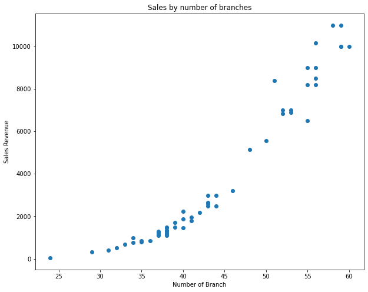
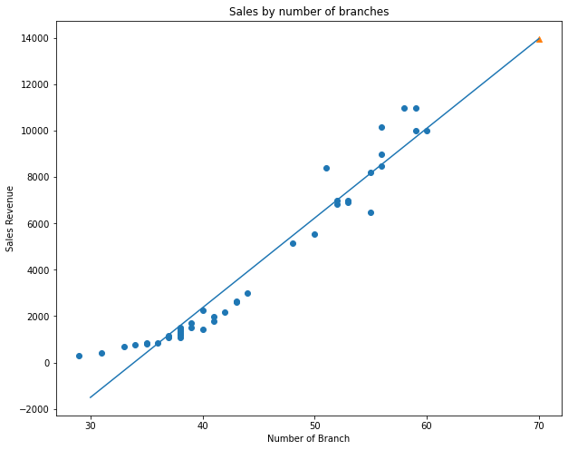
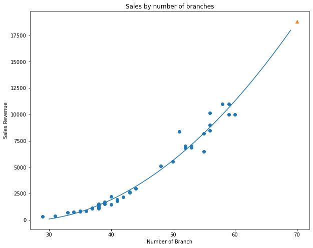

# 본 자료는 bada학회가 진행하는 "경영학을 위한 머신러닝 기초"에 사용될 예제입니다.

<br/>

### 작성자
김지욱
<br/>

### 작성일시
2022.5.27
<br/>

### 학습주제
선형회귀, 다중회귀
<br/>

### 학습목표
- (데이터 전처리) Numpy를 사용하여, array(), column_stack(), arrange() 메소드를 실습한다.
- (데이터 시각화) Matplotlib을 사용하여, plot(), scatter() 메소드를 실습한다.
- (머신러닝) Scikit-Learn의 Linear_model 중 LinearRegression 클래스를 사용하여, fit(), predict(), score() 메소드를 실습한다.
<br/>
<br/>

## 개요
<div align=center>
    <p>
        티라노 닭강정은
    </p>
    <p>
        최근 가장 인기 있는 신생 프렌차이즈 업체이다.
    </p>
    
만드는대로 팔린다.

<br/>

그러던 어느날,

티라노 사장님은 

점점 늘어가는 지점 갯수를 살펴보다가,

심각한 고민에 빠졌다.

<br/>

그것은 바로

지점의 갯수에 따른 매출수익을 알고 싶어졌던 것이다.

<br/>

그렇게 티라노 사장은

고려대학교 경영대학 경영데이터분석학회 bada를 찾게 되는데...
<br/>
</div>
 <br/>
 <br/>
 <br/>
 
## 데이터 살펴보기

<div>
    <p>
        우선 아래에 있는 티라노 닭강정의 데이터를 살펴보자.
    </p>
</div>


```python
branch_num = [24, 29, 31, 32, 33, 34, 34, 35, 35, 36, 37, 37, 37, 37, 38, 38, 38, 38, 38, 38, 38, 38, 39, 39, 40, 40, 40, 41, 41, 42, 43, 43, 43, 43, 44, 44, 46, 48, 50, 51, 52, 52, 53, 53, 55, 55, 55, 56, 56, 56, 56, 58, 59, 59, 59, 60]
sales = [43, 313, 393, 503, 693, 993, 773, 793, 843, 843, 1093, 1143, 1243, 1293, 1193, 1193, 1293, 1343, 1093, 1293, 1493, 1443, 1493, 1693, 2243, 1443, 1873, 1793, 1963, 2173, 2993, 2593, 2643, 2493, 2493, 2993, 3193, 5133, 5553, 8393, 6843, 6993, 6993, 6893, 8993, 6493, 8193, 8493, 8993, 10143, 8193, 10993, 9993, 10993, 9993, 9993]
```
<div>
    <p>
        branch_num은 지점의 갯수를 의미한다고 한다.
    </p>
    <p>
        sales는 매출액을 의미한다고 한다.
    </p>
</div>

<br/>
<br/>
<br/>

<div>
    <p>
        그런데, 이와 같이 나열되어 있는 데이터를 해석하기 쉽지 않다.
    </p>
    <p>
        그리하여 이를 시각화하기로 한다.
    </p>
</div>

```python
import matplotlib.pyplot as plt

plt.figure(figsize=(10,8))
plt.scatter(branch_num, sales)
plt.title('Sales by number of branches')
plt.xlabel('Number of Branch')
plt.ylabel('Sales Revenue')
plt.show
```


    <function matplotlib.pyplot.show(close=None, block=None)>


    

    

<br/>
<br/>
<br/>

# 데이터 전처리하기


```python
import numpy as np

branch_num_np = np.array(branch_num) 
sales_np = np.array(sales) 
```

<br/>
<br/>
<br/>

```python
from sklearn.model_selection import train_test_split

train_input, test_input, train_target, test_target = train_test_split(branch_num_np, sales_np, random_state=42)
```

<br/>
<br/>
<br/>

```python
### 치지 말고 눈으로만 보세요!

print(f'branch_num - num={len(branch_num)}')
print(f'sales - num={len(sales)}')
print()
print(f'train_input - num={len(train_input)} %={len(train_input)/len(branch_num)}')
print(f'train_target - num={len(train_target)} %={len(train_target)/len(branch_num)}')
print()
print(f'test_input - num={len(test_input)} %={len(test_input)/len(branch_num)}')
print(f'test_target - num={len(test_target)} %={len(test_target)/len(branch_num)}')
```

    branch_num - num=56
    sales - num=56
    
    train_input - num=42 %=0.75
    train_target - num=42 %=0.75
    
    test_input - num=14 %=0.25
    test_target - num=14 %=0.25


<br/>
<br/>
<br/>

```python
from sklearn.linear_model import LinearRegression

lr = LinearRegression()

lr.fit(train_input, train_target)   ### 당연히 에러가 발생합니다. 왜냐하면 input의 형태가 올바르지 못하기 때문
```


    ---------------------------------------------------------------------------

    ValueError                                Traceback (most recent call last)

    /var/folders/hz/hxmpndyx46ncqhsm2yc43k8r0000gn/T/ipykernel_36626/2361219794.py in <module>
          3 lr = LinearRegression()
          4 
    ----> 5 lr.fit(train_input, train_target)   ### 당연히 에러가 발생합니다. 왜냐하면 input의 형태가 올바르지 못하기 때문
    

    ~/opt/anaconda3/lib/python3.9/site-packages/sklearn/linear_model/_base.py in fit(self, X, y, sample_weight)
        516         accept_sparse = False if self.positive else ['csr', 'csc', 'coo']
        517 
    --> 518         X, y = self._validate_data(X, y, accept_sparse=accept_sparse,
        519                                    y_numeric=True, multi_output=True)
        520 


    ~/opt/anaconda3/lib/python3.9/site-packages/sklearn/base.py in _validate_data(self, X, y, reset, validate_separately, **check_params)
        431                 y = check_array(y, **check_y_params)
        432             else:
    --> 433                 X, y = check_X_y(X, y, **check_params)
        434             out = X, y
        435 


    ~/opt/anaconda3/lib/python3.9/site-packages/sklearn/utils/validation.py in inner_f(*args, **kwargs)
         61             extra_args = len(args) - len(all_args)
         62             if extra_args <= 0:
    ---> 63                 return f(*args, **kwargs)
         64 
         65             # extra_args > 0


    ~/opt/anaconda3/lib/python3.9/site-packages/sklearn/utils/validation.py in check_X_y(X, y, accept_sparse, accept_large_sparse, dtype, order, copy, force_all_finite, ensure_2d, allow_nd, multi_output, ensure_min_samples, ensure_min_features, y_numeric, estimator)
        869         raise ValueError("y cannot be None")
        870 
    --> 871     X = check_array(X, accept_sparse=accept_sparse,
        872                     accept_large_sparse=accept_large_sparse,
        873                     dtype=dtype, order=order, copy=copy,


    ~/opt/anaconda3/lib/python3.9/site-packages/sklearn/utils/validation.py in inner_f(*args, **kwargs)
         61             extra_args = len(args) - len(all_args)
         62             if extra_args <= 0:
    ---> 63                 return f(*args, **kwargs)
         64 
         65             # extra_args > 0


    ~/opt/anaconda3/lib/python3.9/site-packages/sklearn/utils/validation.py in check_array(array, accept_sparse, accept_large_sparse, dtype, order, copy, force_all_finite, ensure_2d, allow_nd, ensure_min_samples, ensure_min_features, estimator)
        692             # If input is 1D raise error
        693             if array.ndim == 1:
    --> 694                 raise ValueError(
        695                     "Expected 2D array, got 1D array instead:\narray={}.\n"
        696                     "Reshape your data either using array.reshape(-1, 1) if "


    ValueError: Expected 2D array, got 1D array instead:
    array=[35 38 34 33 52 41 56 55 59 38 36 38 40 43 59 56 40 37 43 56 48 42 52 29
     38 31 53 51 44 39 55 37 39 38 60 38 35 53 38 41 58 50].
    Reshape your data either using array.reshape(-1, 1) if your data has a single feature or array.reshape(1, -1) if it contains a single sample.


<br/>
<br/>
<br/>

```python
# 치지말고 눈으로만 보세요

print(f'train_input - shape={train_input.shape}')
print(f'test_input - shape={test_input.shape}')
```

    train_input - shape=(42,)
    test_input - shape=(14,)

<br/>
<br/>
<br/>

```python
train_input_reshaped = train_input.reshape(-1,1)
test_input_reshaped = test_input.reshape(-1,1)
```

<br/>
<br/>
<br/>

```python
# 치지말고 눈으로만 보세요

print(f'train_input - shape={train_input_reshaped.shape}')
print(f'test_input - shape={test_input_reshaped.shape}')
```

    train_input - shape=(42, 1)
    test_input - shape=(14, 1)

<br/>
<br/>
<br/>

# 머신러닝 학습하기(선형회귀)


<br/>
<br/>
<br/>

```python
from sklearn.linear_model import LinearRegression

lr = LinearRegression()
lr.fit(train_input_reshaped, train_target)
```


    LinearRegression()


<br/>
<br/>
<br/>

```python
print(f'LinearRegresssion Info - Coefficient={lr.coef_} intercept={lr.intercept_}')
```

    LinearRegresssion Info - Coefficient=[386.86819283] intercept=-13112.978625865037


<br/>
<br/>
<br/>

```python
print(lr.predict([[70]]))
```

    [13967.79487254]


<br/>
<br/>
<br/>

```python
plt.figure(figsize=(10,8))
plt.scatter(train_input_reshaped, train_target)
plt.plot(
    [30, 70],
    [30*lr.coef_ + lr.intercept_, 70*lr.coef_ + lr.intercept_]
)
plt.scatter(70, lr.predict([[70]]), marker='^')
plt.title('Sales by number of branches')
plt.xlabel('Number of Branch')
plt.ylabel('Sales Revenue')
plt.show
```


    <function matplotlib.pyplot.show(close=None, block=None)>


    

    


<br/>
<br/>
<br/>

```python
lr.score(train_input_reshaped, train_target)
```


    0.9418795136747918


<br/>
<br/>
<br/>

```python
lr.score(test_input_reshaped, test_target)
```


    0.8277748236507337


<br/>
<br/>
<br/>

```python
# 치지말고 눈으로만 보세요!
print(f'train_input - shape={train_input.shape}')
print(f'test_input - shape={test_input.shape}')
print()

print(f'train_input_reshaped - shape={train_input_reshaped.shape}')
print(f'test_input_reshaped - shape={test_input_reshaped.shape}')
print()

print(f'LinearRegresssion - Coefficient={lr.coef_} intercept={lr.intercept_}')
print(f'LinearRegresssion - prediction{lr.predict([[70]])}')
print()

print(f'train_input_reshaped - score={round(lr.score(train_input_reshaped, train_target),2)}')
print(f'test_input_reshaped - score={round(lr.score(test_input_reshaped, test_target),2)}')
```

    train_input - shape=(42,)
    test_input - shape=(14,)
    
    train_input_reshaped - shape=(42, 1)
    test_input_reshaped - shape=(14, 1)
    
    LinearRegresssion - Coefficient=[386.86819283] intercept=-13112.978625865037
    LinearRegresssion - prediction[13967.79487254]
    
    train_input_reshaped - score=0.94
    test_input_reshaped - score=0.83


# 머신러닝 학습하기(다중회귀)


<br/>
<br/>
<br/>

```python
train_input_reshaped_polynominal = np.column_stack((train_input_reshaped ** 2, train_input))
train_input_reshaped_polynominal
```


    array([[1225,   35],
           [1444,   38],
           [1156,   34],
           [1089,   33],
           [2704,   52],
           [1681,   41],
           [3136,   56],
           [3025,   55],
           [3481,   59],
           [1444,   38],
           [1296,   36],
           [1444,   38],
           [1600,   40],
           [1849,   43],
           [3481,   59],
           [3136,   56],
           [1600,   40],
           [1369,   37],
           [1849,   43],
           [3136,   56],
           [2304,   48],
           [1764,   42],
           [2704,   52],
           [ 841,   29],
           [1444,   38],
           [ 961,   31],
           [2809,   53],
           [2601,   51],
           [1936,   44],
           [1521,   39],
           [3025,   55],
           [1369,   37],
           [1521,   39],
           [1444,   38],
           [3600,   60],
           [1444,   38],
           [1225,   35],
           [2809,   53],
           [1444,   38],
           [1681,   41],
           [3364,   58],
           [2500,   50]])


<br/>
<br/>
<br/>

```python
test_input_reshaped_polynominal = np.column_stack((test_input_reshaped ** 2, test_input))
test_input_reshaped_polynominal
```


    array([[ 576,   24],
           [1156,   34],
           [1849,   43],
           [1369,   37],
           [1444,   38],
           [3136,   56],
           [2116,   46],
           [1600,   40],
           [3025,   55],
           [1369,   37],
           [3481,   59],
           [1024,   32],
           [1936,   44],
           [1849,   43]])


<br/>
<br/>
<br/>

```python
print(f'train_input - shape={train_input_reshaped_polynominal.shape}')
print(f'test_input - shape={test_input_reshaped_polynominal.shape}')
```

    train_input - shape=(42, 2)
    test_input - shape=(14, 2)


<br/>
<br/>
<br/>

```python
lr = LinearRegression()
lr.fit(train_input_reshaped_polynominal, train_target)
```


    LinearRegression()


<br/>
<br/>
<br/>

```python
lr.predict([[70**2, 70]])
```


    array([18828.01210951])


<br/>
<br/>
<br/>

```python
print(f'prediction={lr.predict([[70**2, 70]])}')
print(f'LinearRegresssion Info - Coefficient={lr.coef_} intercept={lr.intercept_}')
```

    prediction=[18828.01210951]
    LinearRegresssion Info - Coefficient=[   9.54067301 -485.62129727] intercept=6072.205188515765


<br/>
<br/>
<br/>

```python
plt.figure(figsize=(10,8))
plt.scatter(train_input_reshaped, train_target)
plt.plot(
    np.arange(30, 70),
    (lr.coef_[0]*(point ** 2)) + (lr.coef_[1]*point) + (lr.intercept_)
)
plt.scatter(70, lr.predict([[4900, 70]]), marker='^')
plt.title('Sales by number of branches')
plt.xlabel('Number of Branch')
plt.ylabel('Sales Revenue')
plt.show
```


    <function matplotlib.pyplot.show(close=None, block=None)>


    

    


<br/>
<br/>
<br/>

```python
lr.score(train_input_reshaped_polynominal, train_target)
```


    0.9710954430427848


<br/>
<br/>
<br/>

```python
lr.score(test_input_reshaped_polynominal, test_target)
```


    0.9803979034033079


<br/>
<br/>
<br/>

```python
# 치지말고 눈으로만 보세요
print(f'train_input - shape={train_input.shape}')
print(f'test_input - shape={test_input.shape}')
print()

print(f'train_input_reshaped_polynominal - shape={train_input_reshaped_polynominal.shape}')
print(f'test_input_reshaped_polynominal - shape={test_input_reshaped_polynominal.shape}')
print()

print(f'LinearRegresssion - Coefficient={lr.coef_} intercept={lr.intercept_}')
print(f'LinearRegresssion - prediction={lr.predict([[70**2, 70]])}')
print()

print(f'train_input_reshaped - score={round(lr.score(train_input_reshaped_polynominal, train_target),2)}')
print(f'test_input_reshaped - score={round(lr.score(test_input_reshaped_polynominal, test_target),2)}')
```

    train_input - shape=(42,)
    test_input - shape=(14,)
    
    train_input_reshaped_polynominal - shape=(42, 2)
    test_input_reshaped_polynominal - shape=(14, 2)
    
    LinearRegresssion - Coefficient=[   9.54067301 -485.62129727] intercept=6072.205188515765
    LinearRegresssion - prediction=[18828.01210951]
    
    train_input_reshaped - score=0.97
    test_input_reshaped - score=0.98

